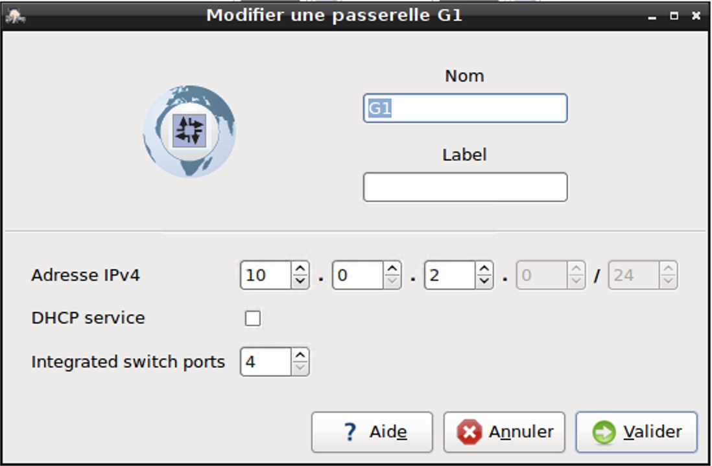
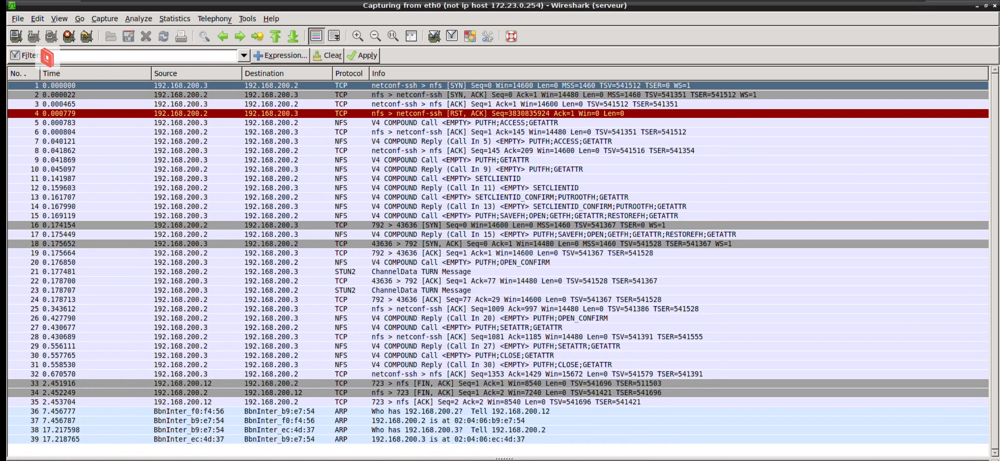
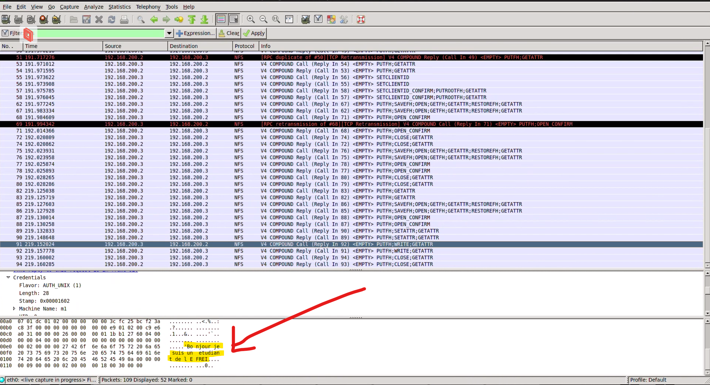

# TP02 - Jean-Michel REMEUR, Arsène LAPOSTOLET, Maud GELLEE, Thomas LACAZE

## Configurations du service DHCP et des machines clientes

## <u>Sur le serveur</u>

#### Fixe l'ip avec `/etc/network/interfaces`

```conf
auto eth0
iface eth0 inet static
    address 192.168.200.2
    netmask 255.255.255.0
    gateway 192.168.200.2
```

Puis restart le service networking
```sh
$ sudo service networking restart
```


#### Configuration du serveur dhcp avec le range voulu `/etc/dhcp/dhcpd.conf`

```conf
subnet 192.168.200.0 netmask 255.255.255.0 {    
    default-lease-time: 86400;
    option routers 192.168.200.2;
    pool {
        allow unknown-clients;
        range 192.168.200.10 192.168.200.20;
    }
}
```

Puis restart le service dhcpd
```sh
$ sudo service isc-dhcp-server restart
```

Désactiver le serveur dhcp de la gateway 1
```sh
$ sudo ssh etudiant@10.2.0.2 
$ sudo service isc-dhcp-server stop
```



## <u>Sur M1 et M2</u>

Suppression de l'adresse fixe dans `/etc/network/interfaces` :

```conf
allowhotplug eth0
auto eth0
iface eth0 inet dhcp
```

Puis 
```bash
$ sudo service networking restart
```

## <u>Sur M1</u>

Fixe l'ip dans la configuration DHCP du serveur `/etc/dhcp/dhcpd.conf`
```conf
    host m1 {
        hardware ethernet 02:04:ec:4d:37;
        fixed-address 192.168.200.3;
    }
```

## <u>Sur M2</u>
```bash
$ sudo dhclient -r
```

### <u>Création des répertoires sur le serveur</u>

```bash
$ mkdir -p /home/nfs1
$ chown -R 0:2000 /home/nfs1
$ chmod -R 770 /home/nfs1

$ mkdir -p /home/nfs2
$ chown -R 0:2000 /home/nfs2
$ chmod -R 770 /home/nfs2

$ mkdir -p /home/nfs
$ chown -R 0:2000 /home/nfs
$ chmod -R 777 /home/nfs

$ mkdir -p /home/nfs/user1
$ chown -R 2001:2000 /home/nfs/user1
$ chmod -R 750 /home/nfs/user1

$ mkdir -p /home/nfs/user2
$ chown -R 2001:2000 /home/nfs/user2
$ chmod -R 750 /home/nfs/user2
```

### <u>Configuration de NFS</u>

Modification de la configuration `/etc/exports`

```sh
$ cp /etc/exports /etc/exports.save
```

Ajout dans `/etc/exports`

```conf
/home/nfs1 192.168.200.3/24 (rw,subtree_check,no_root_squash)
/home/nfs2 192.168.200.11/24 (rw,subtree_check,no_root_squash)
/home/nfs 192.168.200.0/24 (ro,subtree_check,no_root_squash)
```

`no_root_squash` permet de désactiver la transformation administrateur.

(m2 a récupérée l'adresse `192.168.200.11` du serveur DHCP).

Reload du service nfs
```bash
$ /etc/init.d/nfs-kernel-server start
```

## <u>Sur la machine m1</u>
Il faut installer `portmap` et `nfs-common`

On monte les répertoires sur M1 : 
```conf
$ mkdir /home/user1/nfs1
$ mount -t nfs 192.168.200.2:/home/nfs1 /home/user1/nfs1
$ mkdir /home/user1/nfs
$ mount -t nfs 192.168.200.2:/home/nfs /home/user1/nfs
```

On regarde les droits des nouveaux répertoires :
```bash
$ ll /home/user1/nfs
$ ll /home/user1/nfs1
```

On regarde qui sont les users, afin de connaitre leur nom et groupe, pour savoir qui a les droits :
```bash
$ less etc/passwd 
user1:x:2001:2000:...
user2:x:2002:2000:...
```

Pour chaque utilisateur ayant les droits : 
```bash
$ mkdir /home/user1/nfs1/user1
$ mkdir /home/user1/nfs1/user2
```

Sur le serveur, on regarde les droits des répertoires créés : 
```bash
$ ll /home/nfs1
drwr-xr-x 2 2001 2000 user1
drwr-xr-x 2 2002 2000 user2
```

## <u>Sur la machine m2</u>
```conf 
$ sudo nano /etc/fstab
```

Nous devons tout d'abord créer les dossiers qui seront liés au serveur : 
$ mkdir /home/user2/nfs2
$ mkdir /home/user2/nfs

On ajoute directement dans le fichier fstab suivant les informations :

```conf
# <file system>     <dir>       <type>   <options>   <dump>	<pass>
192.168.200.2:/home/nfs2 /home/user2/nfs2 nfs defaults 0 0 
192.168.200.2:/home/nfs /home/user2/nfs nfs defaults 0 0 

```

Forcer la mise à jours des volumes montés par `/etc/fstab`:

```bash
$ mount -a
```

On regarder les droits des nouveaux répertoires

```bash
$ ll /home/user2/nfs
drwxr-x--- 2 user1 user user1
drwxr-x--- 2 user1 user user2
```

Pour chaque utilisateur ayant les droits :

```bash
$ mkdir /home/user2/nfs2/user1  
```

Sur le serveur, on regarde les droits des répertoires créés :

```bash
$ ll /home/nfs2
drwr-xr-x 2 2001 2000 user1
drwr-xr-x 2 2002 2000 user2
```

## <u>Utilisation de Wireshark</u>



Les protocoles utilisés par NFS sont :
- RPC
- TCP
- IP
- Ethernet

Les ports utilisés par NFS sont :
- 830
- 2049



Comme on peut le voir sur la photo ci-dessus, le contenu du payload est lisible (on peut en effet lire "Bonjour, je suis un étudiant de l’EFREI").
On en déduit donc que les échanges entre la machine m1 et le serveur ne sont pas chiffrés.